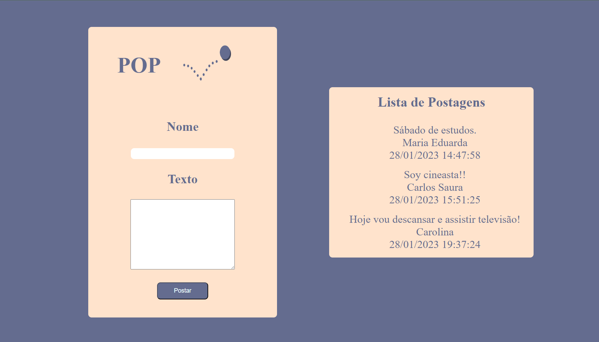

<h2>Pop Posts</h2>
 

 Exercise developed during Senai's DEVinHouse course (2022/2023).

Simple Interface, API and Database were created. Through the interface, you can save posts in the database. The list of posts is displayed on the page right side.

 
<ul>
<li>C#</li>
<li>.Net</li>
<li>HTML</li>
<li>CSS</li>
<li>JS</li>
</ul>
 
 

 
 
